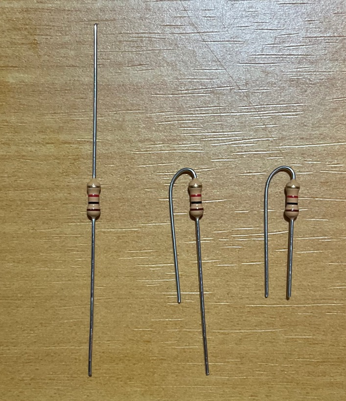
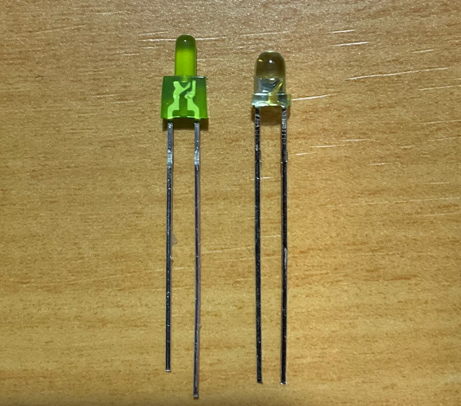
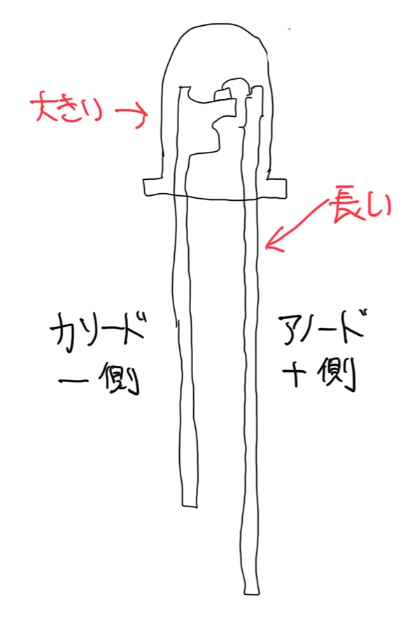

# Arduino+ブレッドボード超入門

これは、まずArduinoとブレッドボードで何か初めてみたい場合の入門書です。必要なものとブレッドボードでLEDをチカチカするところまで説明します。

# 必要なもの

ほとんどのものは秋月電子でそろいます。ここにあげたもののほかにも、ニッパー、ラジオペンチ、テスターなどがあるといいです。

品名 | 店舗 | 単価 | 個数 | 小計 | 複数人で分ける | 備考
---|---|---|---|---|---|---
Arduino Nano Every | [秋月電子](https://akizukidenshi.com/catalog/g/gM-14848/) | 1500 | 1 |  |  | 
ＵＳＢケーブル　ＵＳＢ２．０　Ａオス－マイクロＢオス　１．５ｍ　Ａ－ｍｉｃｒｏＢ | [秋月電子](https://akizukidenshi.com/catalog/g/gC-07607/) | 120 | 1 |  |  | すでにあるなら不要
ブレッドボード EIC-102J | [秋月電子](https://akizukidenshi.com/catalog/g/gP-02314/) | 650 | 1 |  |  | 
ブレッドボード・ジャンパーワイヤ（オス－オス）セット　各種　合計６０本以上 | [秋月電子](https://akizukidenshi.com/catalog/g/gC-05159/) | 220 | 1 |  |  | フレキシブルタイプ
ブレッドボード・ジャンパーワイヤ　１４種類×５本 | [秋月電子](https://akizukidenshi.com/catalog/g/gP-02315/) | 300 | 1 |  |  | 単線タイプ、フレキシブルタイプだけでもいい
タクトスイッチセット 100個セット | [秋月電子](https://akizukidenshi.com/catalog/g/gP-01282/) | 700 | 1 |  | 〇 | 
炭素皮膜抵抗　1/2W 1KΩ 100本 | [秋月電子](https://akizukidenshi.com/catalog/g/gR-07820/) | 100 | 1 |  | 〇 | 
炭素皮膜抵抗　1/2W 10KΩ 100本 | [秋月電子](https://akizukidenshi.com/catalog/g/gR-07838/) | 100 | 1 |  | 〇 | 今回は使わないけどあるといい
３ｍｍ赤色ＬＥＤ　OSDR3133A 100個 | [秋月電子](https://akizukidenshi.com/catalog/g/gI-14799/) | 350 | 1 |  | 〇 | 
３ｍｍ黄緑色ＬＥＤ OSNG3133A 100個 | [秋月電子](https://akizukidenshi.com/catalog/g/gI-00563/) | 450 | 1 |  | 〇 | 

# Arduino とは？

* イタリア生まれ
* AVRを主としたマイコンにC++のライブラリやオープンソースのビルド環境をパッケージにした非常に簡単な開発環境
* Arduino言語は初心者には難しいAVR-C(AVRマイコン用のCコンパイラ)にC++にライブラリを追加して使いやすい言語にしていますが、決して子供だましのものではありません。言語自体は直接AVR-CでビルドできるC++なのです。そのためやる気になればネイティブなコードも書くことが出来ます。

## Arduino Nano Every とは？

* [ARDUINO NANO EVERY](https://www.arduino.cc/en/Guide/NANOEvery)

* Arduinoの基本はATmega328を使ったArduino Unoだが、価格が安い純正の次世代Arduinoであるこれを使う。最新世代のATmegaであるATmega4809が使用されている。

## Arduino Nano Everyのピン配列

## Nano Every セットアップ

* [Getting started with the Arduino Nano Every](https://www.arduino.cc/en/Guide/NANOEvery)

まずは、Arduino実行環境の準備と接続を行う。

1. [ここ](https://www.arduino.cc/en/software)からArduino IDEをダウンロードしインストールする
2. インストールしたArduino(Arduino IDE) を起動する
3. ツール > ボード > ボードマネージャを選択する
4. 検索フィルタに megaavrと入力する
5. 候補に「Arduino megaAVR Boards」がでてくるのでインストールして閉じる
6. Arduino Nano EveryをMicroUSBケーブルでPCに接続し、グリーンのランプがつくことを確認。
7. ツール > ボード > Arduino megaAVR Boards > Arduino Nano Everyを選ぶ
8. Arduino Nano Everyを選ぶ
9. ツール > シリアルポート > COMX(Arduino Nano Every)を選ぶ (COMXのXはパソコンによって異なる)

## 何も起こらないプログラムを書き込む

1. ファイル > 新規ファイル を開く
2. (➡) ボタンをクリックして書き込む
3. 特にエラーなく書き込めば成功。デフォルトで橙LEDが点滅していたら、それが止まる。

# Lチカを行う

Lチカ(LEDチカチカ) はLEDを点滅するだけのプログラム。これでマイコンに正しくプログラムが書き込めるかを確認することができます。デジタル回路は0か1かで通信するので、このLEDチカチカというのは多くの回路の基本になります。

## Lチカプログラムを書き込む

Arduinoには豊富なサンプルコードがあります。このLチカプログラムもサンプルにあります。

1. ファイル > スケッチ例 > 01.Blinks > Blink を開く
2. (➡) ボタンをクリックして書き込む
3. 本体内蔵のLEDが１秒ごとに点滅すればOK

サンプルプログラムには英語で説明が書かれています。コメントを抜くとこんな感じです。

	void setup() {
	  pinMode(LED_BUILTIN, OUTPUT);
	}
	void loop() {
	  digitalWrite(LED_BUILTIN, HIGH);
	  delay(1000);
	  digitalWrite(LED_BUILTIN, LOW);
	  delay(1000);
	}

pinModeでピンの入出力の指定、digitalWriteでピンのオンオフ、delayでミリ秒単位で処理を停止させています。

## Lチカを早くする

では、この点滅の速度を早くするにはどうすればいいでしょう？それはdelay(1000)の数字を減らせばいいだけです。2つのdelayをdelay(100)にして書き込んで見ましょう。LEDの点滅がめっちゃ早くなったら成功です。

# ブレッドボードを始める

ブレッドボードは半田付けなしで電子部品の動作が確認できる板で、それぞれが端子になっています。その端子は基本縦に通電するようになっています。くわしくは[このへん](https://iot.keicode.com/electronics/what-is-breadboard.php) のサイトをご覧下さい。

## 下準備

抵抗は折り曲げて足の長さを切りそろえておくと、ブレッドボードに刺しやすいです。

LEDも足を切りそろえておくと便利なのですが、LEDの足の長さには極性を示す意味もあるので注意です。ただ、中のよく見ると極性を見分けることができます。中の金属部分が大きいのがカソード(-側)です。

続く・・・・・